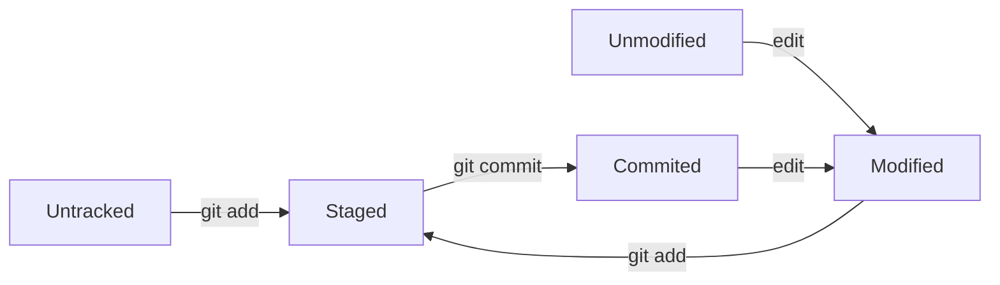

# 03. Базовые команды (add, commit, status, log)

Это основа основ Git. `add`, `commit`, `status` и `log` — это те команды, которые вы будете использовать чаще всего. Они образуют основной рабочий цикл разработчика и администратора.

## Жизненный цикл файлов в Git

Прежде чем перейти к командам, важно понять, как файлы перемещаются между состояниями:



## git status: Проверка состояния

Команда `git status` показывает текущее состояние вашей рабочей директории и индекса (staging area). Это ваш главный инструмент, чтобы понять, что сейчас происходит в репозитории.

```bash
git status
```

**Пример вывода:**

```text
On branch main
Changes not staged for commit:
  (use "git add <file>..." to update what will be committed)
  (use "git restore <file>..." to discard changes in working directory)
        modified:   README.md

Untracked files:
  (use "git add <file>..." to include in what will be committed)
        new_script.sh

no changes added to commit (use "git add" and/or "git commit -a")
```

**Разберем вывод:**

| Сообщение | Что это значит |
| :--- | :--- |
| `Changes not staged for commit` | Файлы изменены, но не добавлены в индекс. Чтобы их закоммитить, нужно сначала выполнить `git add`. |
| `Untracked files` | Новые файлы, которые Git еще не отслеживает. Их также нужно добавить через `git add`. |
| `no changes added to commit` | В индексе нет изменений, и создавать коммит не из чего. |
| `Changes to be committed` | Файлы уже в индексе и готовы к коммиту. |

### Сокращенный формат статуса

```bash
# Сокращенный вывод
git status -s

# Пример вывода:
# ?? new_file.txt    - неотслеживаемый файл
# A  added_file.txt  - добавлен в индекс
# M  modified.txt    - изменен и добавлен в индекс
# M  modified.txt    - изменен, но не добавлен
```

## git add: Добавление в индекс

Команда `git add` добавляет изменения из рабочей директории в индекс (staging area). Это позволяет вам выбирать, какие именно изменения войдут в следующий коммит.

| Команда | Описание |
| :--- | :--- |
| `git add <file>` | Добавить конкретный файл. |
| `git add <dir>` | Добавить все изменения в указанной директории и ее поддиректориях. |
| `git add .` | Добавить все изменения в текущей директории и ниже. |
| `git add -A` | Добавить все изменения во всем репозитории (включая удаления). |
| `git add -u` | Добавить только измененные и удаленные файлы (не добавляет новые). |
| `git add -p` | Интерактивный режим. Позволяет по частям добавлять изменения из одного файла. |

**Примеры:**

```bash
# Добавляем конкретный файл
git add index.html

# Добавляем все изменения в папке src
git add src/

# Добавляем все изменения в проекте
git add .

# Интерактивно выбираем, что добавить из файла
git add -p file.py
```

## git commit: Фиксация изменений

Команда `git commit` создает новый снимок (коммит) содержимого индекса. Каждый коммит должен иметь сообщение, описывающее внесенные изменения.

```bash
# Создать коммит с сообщением
git commit -m "Добавлена новая функция аутентификации"

# Создать коммит с многострочным сообщением
git commit
# После ввода команды откроется редактор, где нужно написать заголовок,
# затем пустую строку, и затем подробное описание.

# Создать коммит с добавлением всех изменений (добавляет -a)
git commit -a -m "Обновить конфигурацию"
```

### Рекомендации по сообщениям коммитов (Conventional Commits)

Стандарт **Conventional Commits** помогает делать сообщения коммитов понятными и структурированными:

| Тип | Описание | Пример |
| :--- | :--- | :--- |
| `feat:` | Новая функциональность | `feat: add user authentication` |
| `fix:` | Исправление ошибки | `fix: resolve memory leak in parser` |
| `docs:` | Изменения в документации | `docs: update installation guide` |
| `style:` | Форматирование кода (не влияют на логику) | `style: format code with black` |
| `refactor:` | Рефакторинг кода | `refactor: simplify error handling` |
| `perf:` | Улучшение производительности | `perf: optimize database queries` |
| `test:` | Добавление или изменение тестов | `test: add unit tests for auth module` |
| `chore:` | Изменения в процессе сборки или инструментах | `chore: update dependencies` |

**Пример хорошего сообщения:**

```text
feat: add user authentication with JWT

- Implement login and registration endpoints
- Add JWT token generation and validation
- Create middleware for protected routes
- Update user model with password hashing
```

### Правила хорошего коммита

1. **Заголовок не длиннее 50 символов**
2. **Заголовок пишется в повелительном наклонении** ("Add feature", не "Added feature")
3. **Заголовок с маленькой буквы**
4. **Без точки в конце заголовка**
5. **Тело коммита (если есть) отделяется пустой строкой от заголовка**
6. **В теле коммита объясняется "почему", а не "что"** (что видно в diff)

## git log: История коммитов

Команда `git log` отображает историю коммитов в обратном хронологическом порядке (последние сверху).

```bash
# Полная история
git log

# Сжатая история (одна строка на коммит)
git log --oneline

# История с графиком веток
git log --oneline --graph

# История с изменениями (патчем)
git log -p

# История за последние N коммитов
git log -n 3

# История с поиском по ключевому слову в сообщении
git log --grep="fix"

# История с поиском по содержимому изменений
git log -S "function_name"

# История за определенный период
git log --since="1 week ago"
git log --since="2024-01-01" --until="2024-01-31"

# Авторские фильтры
git log --author="John"
```

### Полезные алиасы для git log

Добавьте в `~/.gitconfig`:

```bash
[alias]
    graph = log --oneline --graph --all --decorate
    hist = log --pretty=format:'%h %ad | %s%d [%an]' --graph --date=short
```

## git commit --amend: Исправление последнего коммита

Иногда нужно исправить последний коммит — добавить забытый файл или изменить сообщение.

```bash
# Изменить сообщение последнего коммита
git commit --amend -m "New commit message"

# Добавить файл в последний коммит
echo "Forgotten content" > forgot.txt
git add forgot.txt
git commit --amend

# Исправить коммит без изменения сообщения
git commit --amend --no-edit
```

> [!warning]
> `git commit --amend` изменяет историю. Если вы уже отправили (`push`) этот коммит в удаленный репозиторий, не используйте `amend` — это может создать проблемы для других разработчиков.

## Сравнение основных команд

| Команда | Назначение | Результат |
| :--- | :--- | :--- |
| `git status` | Посмотреть состояние | Информация о рабочих изменениях и индексе |
| `git add` | Подготовить изменения | Файлы перемещаются в индекс (staging area) |
| `git commit` | Сохранить изменения | Создается новый коммит из индекса |
| `git log` | Посмотреть историю | Список коммитов с их описанием |

> [!tip]
> Всегда делайте коммиты атомарными (логически законченными). Один коммит — одна логическая задача. Используйте `git add -p`, чтобы разбить большие изменения на несколько коммитов.

> [!note]
> Команды `add`, `commit`, `status` и `log` — это ваши основные инструменты. Освоив их, вы сможете работать с Git в 80% повседневных задач.