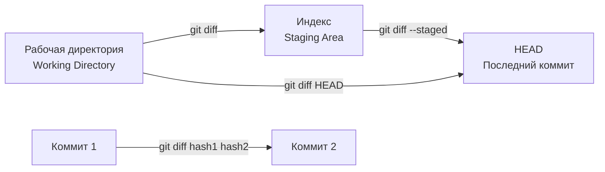
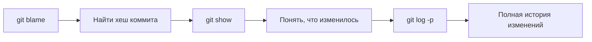

# 05. Просмотр истории и сравнение (diff, show, blame)

В процессе работы с проектом важно уметь смотреть историю изменений, сравнивать разные версии файлов и понимать, кто и когда внес те или иные правки. В Git для этого есть несколько ключевых команд: `diff`, `show` и `blame`.

## Сравнение различных состояний в Git

Прежде чем углубиться в команды, важно понять, какие состояния можно сравнивать:



## git diff: Сравнение изменений

Команда `git diff` показывает различия между двумя сущностями (рабочей директорией, индексом, коммитами, ветками). Это ваш главный инструмент для просмотра изменений до того, как вы их закоммитите.

### Основные варианты использования

| Команда | Сравнивает |
| :--- | :--- |
| `git diff` | Рабочую директорию с индексом |
| `git diff --staged` | Индекс с последним коммитом (HEAD) |
| `git diff HEAD` | Рабочую директорию с последним коммитом |
| `git diff <hash1> <hash2>` | Два коммита между собой |
| `git diff branch1..branch2` | Две ветки между собой |
| `git diff --cached` | Индекс с HEAD (синоним `--staged`) |

### Примеры использования

```bash
# Просмотр неиндексированных изменений
git diff

# Просмотр изменений в конкретном файле
git diff file.txt

# Просмотр индексированных изменений (в staging area)
git diff --staged

# Сравнение с предыдущим коммитом
git diff HEAD~1 HEAD

# Сравнение двух коммитов
git diff abc123 def456

# Сравнение веток
git diff main..feature
```

### Полезные опции git diff

| Опция | Описание | Пример |
| :--- | :--- | :--- |
| `--name-only` | Показать только имена файлов | `git diff --name-only` |
| `--stat` | Показать статистику изменений | `git diff --stat` |
| `--word-diff` | Показать изменения по словам | `git diff --word-diff` |
| `--color-words` | Цветное выделение изменений | `git diff --color-words` |
| `-U<n>` | Увеличить контекст на n строк | `git diff -U10` |

**Пример вывода `git diff --stat`:**

```text
 example.txt | 3 +++
 1 file changed, 3 insertions(+)
```

### Сравнение с внешними инструментами

Для более удобного сравнения можно использовать GUI-инструменты:

```bash
# Использовать meld для сравнения
git difftool --tool=meld

# Настроить дифф-тул по умолчанию
git config --global diff.tool meld
```

## git show: Просмотр коммита

Команда `git show` отображает информацию о коммите: его хеш, автора, дату, сообщение и изменения (патч).

```bash
# Просмотр последнего коммита
git show

# Просмотр конкретного коммита
git show abc123

# Просмотр только сообщения коммита (без изменений)
git show -s abc123

# Просмотр коммита с изменениями в конкретном файле
git show abc123 -- file.txt

# Просмотр коммита в компактном виде
git show --oneline
```

### Структура вывода git show

```text
commit abc123def456...
Author: John Doe <john@example.com>
Date:   Mon Jan 1 12:00:00 2024 +0000

    feat: add new authentication module

diff --git a/auth.py b/auth.py
new file mode 100644
index 0000000..1234567
--- /dev/null
+++ b/auth.py
@@ -0,0 +1,10 @@
+def login():
+    print("Login function")
```

## git blame: Кто изменил строку

Команда `git blame` (или `git annotate`) показывает, кто, когда и в каком коммите последний раз изменял каждую строку файла. Это незаменимый инструмент для поиска автора бага или понимания истории изменений конкретного участка кода.

```bash
# Базовое использование
git blame file.txt

# Более компактный вывод (без email)
git blame -s file.txt

# Показать только строки с 10 по 20
git blame -L 10,20 file.txt

# Показать время изменения в читаемом формате
git blame -t file.txt

# Показать полную информацию
git blame -f file.txt
```

### Пример вывода git blame

```text
abc12345 (John Doe  2024-01-01 12:00:00 +0000 1) Line 1: Initial content
def67890 (Jane Smith 2024-01-02 14:30:00 +0000 2) Line 2: More content
abc12345 (John Doe  2024-01-01 12:00:00 +0000 3) Line 3: Final content
```

**Что означают колонки:**

| Колонка | Описание |
| :--- | :--- |
| `abc12345` | Хеш коммита, где строка была изменена в последний раз |
| `John Doe` | Автор изменения |
| `2024-01-01 12:00:00` | Дата и время последнего изменения |
| `1)`, `2)`, `3)` | Номера строк |
| `Line 1: Initial content` | Содержание строки |

### Практическое применение git blame

**Сценарий 1: Поиск источника бага**

```bash
# Найти, кто изменил строку с ошибкой
git blame -L 15,15 app.py

# Или найти все изменения, связанные с функцией
git log -S "def calculate" --oneline
```

**Сценарий 2: Понимание истории файла**

```bash
# Просмотреть историю изменений конкретной строки
git blame -l -e file.txt

# Показать коммиты, которые изменяли файл
git log --oneline file.txt
```

## Комбинирование команд для полного анализа

### Отслеживание эволюции строки



```bash
# 1. Найти, кто изменил строку
git blame -L 10,10 file.txt

# 2. Посмотреть полный коммит
git show abc123

# 3. Посмотреть историю изменений файла
git log -p file.txt

# 4. Найти все коммиты, изменившие эту строку
git log -S "specific text" --oneline
```

### Сравнение разных версий файла

```bash
# Сравнить текущую версию с версией 2 коммита назад
git diff HEAD~2 HEAD -- file.txt

# Сравнить две конкретные версии
git diff abc123 def456 -- file.txt

# Показать версию файла из прошлого коммита
git show abc123:file.txt
```

## Итоговая таблица команд

| Команда | Назначение | Пример |
| :--- | :--- | :--- |
| `git diff` | Сравнить рабочую директорию с индексом | `git diff` |
| `git diff --staged` | Сравнить индекс с HEAD | `git diff --staged` |
| `git diff HEAD` | Сравнить рабочую директорию с HEAD | `git diff HEAD` |
| `git diff <hash>` | Сравнить с конкретным коммитом | `git diff abc123` |
| `git show` | Показать последний коммит | `git show` |
| `git show <hash>` | Показать конкретный коммит | `git show abc123` |
| `git blame` | Показать автора каждой строки | `git blame file.txt` |
| `git blame -L` | Показать автора для диапазона строк | `git blame -L 10,20 file.txt` |

> [!tip]
> Используйте `git blame` для поиска виновника бага, но помните: ответственность за баг несет не автор, а сам код. `git blame` — это инструмент для понимания, а не для поиска виноватых.

> [!note]
> История в Git — это мощный ресурс. Умение пользоваться `diff`, `show` и `blame` делает вас более эффективным разработчиком или администратором, позволяя быстро анализировать изменения и решать проблемы.