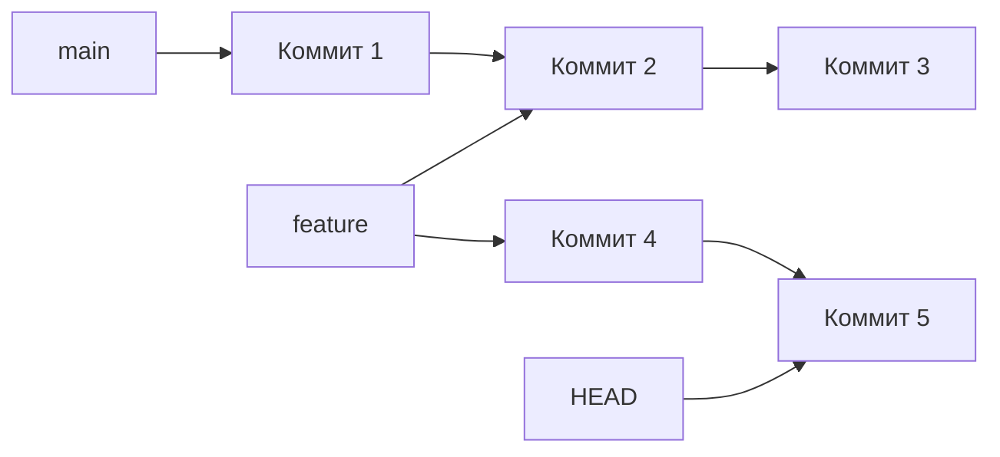

# 01. Создание и управление ветками

Ветки (branches) — это основа параллельной разработки в Git. Они позволяют изолировать разные линии разработки друг от друга, что дает возможность работать над несколькими задачами одновременно, не мешая друг другу.

## Что такое ветка в Git?

В Git ветка — это просто **указатель на коммит**. Когда вы создаете новую ветку, вы создаете новый указатель, который можно перемещать вперед с каждым новым коммитом.



**Ключевые понятия:**

| Понятие | Описание |
| :--- | :--- |
| **main (master)** | Основная ветка, обычно содержит стабильный код |
| **feature ветка** | Ветка для разработки новой функции |
| **HEAD** | Указатель на текущую ветку и коммит |
| **Удаленные ветки** | Ветки, которые существуют на удаленном репозитории |

## Основные команды

### Создание веток

```bash
# Создать ветку (без переключения)
git branch feature/new-feature

# Создать и переключиться
git checkout -b feature/new-feature

# В более новых версиях Git (2.23+)
git switch -c feature/new-feature
```

### Переключение между ветками

```bash
# Переключиться на ветку
git checkout main

# Современный способ (Git 2.23+)
git switch main

# Переключиться с сохранением локальных изменений
git checkout -m main
```

### Просмотр веток

| Команда | Описание |
| :--- | :--- |
| `git branch` | Список локальных веток |
| `git branch -v` | Список с последним коммитом |
| `git branch -a` | Все ветки (локальные + удаленные) |
| `git branch -vv` | Связь локальных веток с удаленными |
| `git branch -r` | Только удаленные ветки |

### Удаление веток

```bash
# Безопасное удаление (только если изменения слиты)
git branch -d feature/old-feature

# Принудительное удаление
git branch -D feature/old-feature

# Удалить удаленную ветку
git push origin --delete feature/old-feature
```

### Переименование веток

```bash
# Переименовать текущую ветку
git branch -m new-name

# Переименовать любую ветку
git branch -m old-name new-name
```

## Практический пример

### Сценарий: Разработка новой функции

```bash
# 1. Начало работы над функцией
git checkout -b feature/user-authentication

# 2. Работа над функцией
echo "def login(): pass" > auth.py
git add auth.py
git commit -m "feat: add login function"

echo "def logout(): pass" >> auth.py
git add auth.py
git commit -m "feat: add logout function"

# 3. Параллельная работа над другой функцией
git checkout main
git checkout -b feature/profile-page

echo "def profile(): pass" > profile.py
git add profile.py
git commit -m "feat: add profile page"

# 4. Возврат к первой функции
git checkout feature/user-authentication

# 5. Завершение работы
git checkout main
git merge feature/user-authentication
git merge feature/profile-page
```

## Сравнение веток

```bash
# Сравнить две ветки
git diff main..feature/new-feature

# Показать коммиты в feature, которых нет в main
git log main..feature/new-feature --oneline

# Показать коммиты в обеих ветках
git log --oneline --graph --all
```

## Git switch vs Git checkout

Начиная с Git 2.23, появилась команда `git switch` для более интуитивной работы с ветками:

| Действие | Старый способ | Новый способ |
| :--- | :--- | :--- |
| Переключиться на ветку | `git checkout branch` | `git switch branch` |
| Создать и переключиться | `git checkout -b branch` | `git switch -c branch` |
| Переключиться на предыдущую | `git checkout -` | `git switch -` |

## Рекомендации по работе с ветками

| Рекомендация | Почему важно |
| :--- | :--- |
| **Используйте описательные имена** | Легче понять цель ветки |
| **Удаляйте слитые ветки** | Поддерживает чистоту репозитория |
| **Не создавайте слишком много веток** | Сложно отслеживать все изменения |
| **Регулярно сливайте с main** | Избегайте больших конфликтов |
| **Используйте feature branches** | Каждая новая функция в своей ветке |

> [!tip]
> Используйте `git branch -d` для удаления слитых веток. Если ветка не слита, Git предупредит вас. Используйте `git branch -D` только если вы уверены, что ветка больше не нужна.

> [!note]
> Ветки в Git — это не папки или копии файлов. Это просто указатели на коммиты. Поэтому создание ветки занимает доли секунды и не требует места на диске.