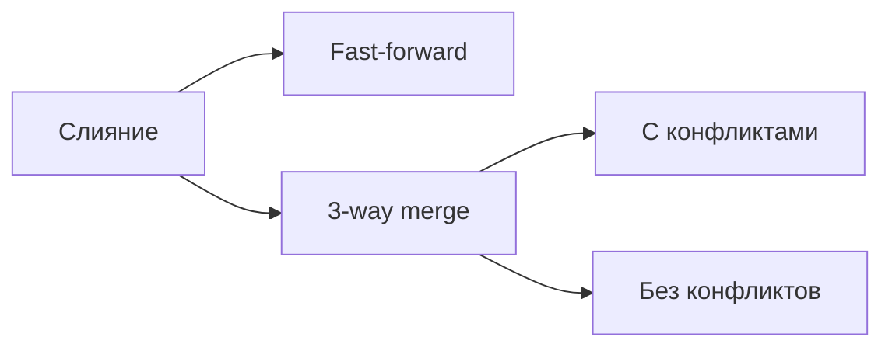
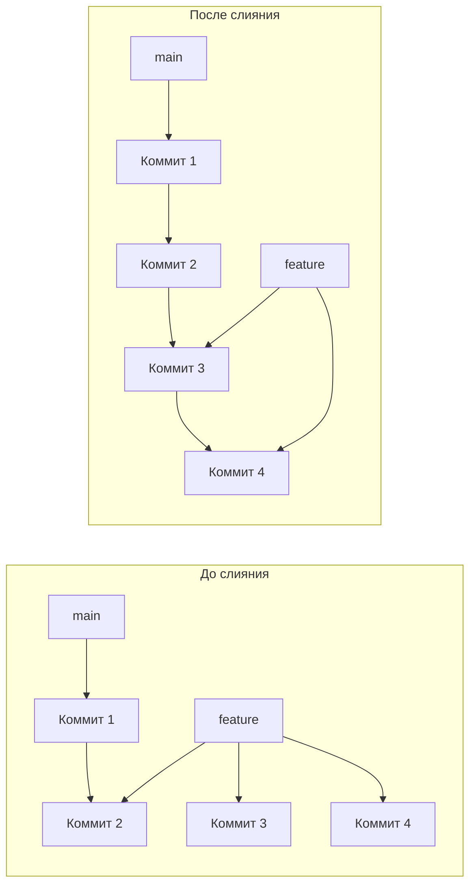
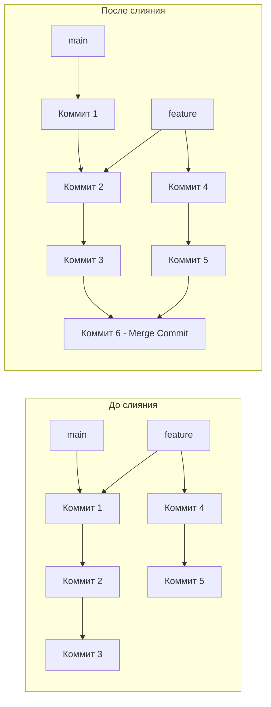
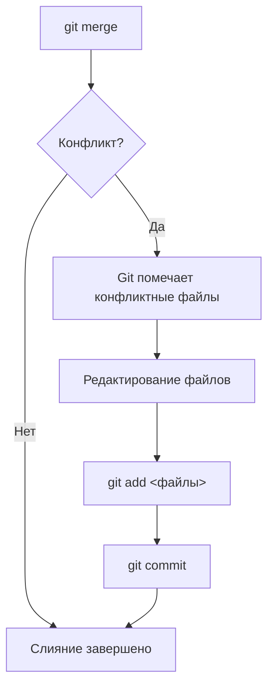

# 02. Слияние веток (merge)

Слияние (merge) — это процесс объединения изменений из одной ветки в другую. Это одна из ключевых операций в Git, которая позволяет интегрировать работу разных разработчиков или объединять завершенные функции с основной веткой.

## Типы слияния в Git



### 1. Fast-forward Merge (Быстрое слияние)

Fast-forward происходит, когда целевая ветка (например, `main`) не имеет новых коммитов с момента создания ветки `feature`. В этом случае Git просто перемещает указатель `main` на последний коммит ветки `feature`.



**Пример:**

```bash
# Создание и работа в feature ветке
git checkout -b feature/simple
echo "New feature" > feature.txt
git add feature.txt
git commit -m "Add feature"

# Fast-forward merge
git checkout main
git merge feature/simple
# Вывод: Updating abc123..def456
# Fast-forward
```

**Когда использовать:** Когда ветка `main` не продвинулась вперед.

### 2. 3-way Merge (Трехстороннее слияние)

3-way merge происходит, когда обе ветки (источник и цель) имеют новые коммиты. Git создает новый **merge commit**, который объединяет изменения из обеих веток.



**Пример:**

```bash
# Создание коммитов в main
git checkout main
echo "Main change" >> main.txt
git add main.txt
git commit -m "Update main.txt"

# Создание и работа в feature ветке
git checkout -b feature/new
echo "Feature change" >> feature.txt
git add feature.txt
git commit -m "Add feature.txt"

# 3-way merge
git checkout main
git merge feature/new
# Создается merge commit
```

## Команды для слияния

### Базовое слияние

```bash
# Слить ветку feature в текущую ветку
git merge feature/new-feature

# Слить с сообщением
git merge feature/new-feature -m "Merge feature/new-feature"

# Отменить слияние (если оно еще не завершено)
git merge --abort
```

### Слияние с опциями

| Опция | Описание | Пример |
| :--- | :--- | :--- |
| `--no-ff` | Создать merge commit, даже если возможен fast-forward | `git merge --no-ff feature` |
| `--ff-only` | Только fast-forward, если невозможно — ошибка | `git merge --ff-only feature` |
| `--squash` | Объединить все коммиты из ветки в один | `git merge --squash feature` |
| `--abort` | Отменить слияние при конфликтах | `git merge --abort` |

## Разрешение конфликтов

### Что такое конфликт?

Конфликт возникает, когда Git не может автоматически объединить изменения, потому что одни и те же строки файла были изменены по-разному в разных ветках.

### Процесс разрешения конфликта



### Пример конфликта

**Исходный файл `main.txt`:**

```
Line 1
Line 2
Line 3
```

**Изменение в main:**

```
Line 1
Line 2 changed in main
Line 3
```

**Изменение в feature:**

```
Line 1
Line 2 changed in feature
Line 3
```

**После попытки слияния, файл выглядит так:**

```
Line 1
<<<<<<< HEAD
Line 2 changed in main
=======
Line 2 changed in feature
>>>>>>> feature
Line 3
```

### Разрешение конфликта вручную

1. **Откройте файл** и найдите маркеры конфликта
2. **Решите**, какие изменения оставить (или объедините их)
3. **Удалите** маркеры конфликта (`<<<<<<<`, `=======`, `>>>>>>>`)
4. **Добавьте** файл в индекс: `git add main.txt`
5. **Завершите** слияние: `git commit`

### Инструменты для разрешения конфликтов

| Инструмент | Описание |
| :--- | :--- |
| **Вручную** | Редактирование файлов в текстовом редакторе |
| **git mergetool** | Использование визуального инструмента (meld, vimdiff) |
| **VS Code** | Встроенная поддержка разрешения конфликтов |
| **IDE** | IntelliJ, PyCharm и др. имеют встроенные инструменты |

```bash
# Использование git mergetool
git mergetool

# Настройка meld как инструмента по умолчанию
git config --global merge.tool meld
```

## Сравнение стратегий слияния

| Стратегия | Описание | Когда использовать |
| :--- | :--- | :--- |
| **Fast-forward** | Перемещение указателя | Простые изменения, нет коммитов в целевой ветке |
| **3-way merge** | Создание merge commit | Когда в обеих ветках есть новые коммиты |
| **--no-ff** | Всегда создавать merge commit | Для сохранения истории ветвления |
| **--squash** | Объединение коммитов в один | Для чистоты истории, когда много мелких коммитов |
| **--ff-only** | Только fast-forward | Для предотвращения случайного слияния |

## Полезные команды для работы с merge

| Команда | Описание |
| :--- | :--- |
| `git merge --abort` | Отменить текущее слияние |
| `git merge --continue` | Продолжить слияние после разрешения конфликтов |
| `git diff` | Просмотр изменений до слияния |
| `git log --graph` | Визуализация истории слияний |
| `git log --merge` | Показать коммиты, участвующие в конфликте |

## Итоговая таблица

| Команда | Назначение |
| :--- | :--- |
| `git merge feature` | Слить ветку feature в текущую |
| `git merge --no-ff feature` | Слить с созданием merge commit |
| `git merge --squash feature` | Слить и объединить коммиты |
| `git merge --abort` | Отменить слияние |
| `git mergetool` | Использовать инструмент для разрешения конфликтов |

> [!tip]
> Используйте `git merge --no-ff` для feature-веток, чтобы сохранить историю ветвления. Это помогает понять, какие изменения были сделаны в рамках одной функции.

> [!warning]
> Никогда не сливайте незавершенные feature-ветки в main. Дождитесь завершения работы и код-ревью.