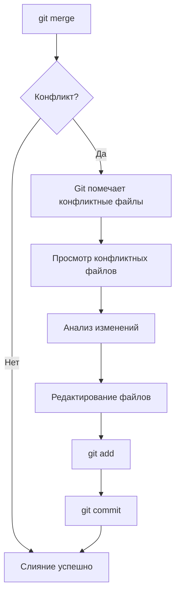

# 03. Решение конфликтов

Конфликты в Git — это неизбежная часть работы в команде. Они возникают, когда несколько разработчиков изменяют одни и те же строки в одном файле или когда один разработчик изменяет файл, а другой его удаляет. Умение эффективно разрешать конфликты — важный навык для любого разработчика.

## Что такое конфликт в Git?

Конфликт возникает, когда Git не может автоматически объединить изменения из разных веток. Это происходит, когда:

1. **Одни и те же строки файла были изменены по-разному** в двух ветках
2. **Один разработчик изменил файл**, а другой его удалил
3. **Один разработчик переименовал файл**, а другой его изменил

## Типы конфликтов

| Тип конфликта | Описание | Сложность |
| :--- | :--- | :--- |
| **Содержимый конфликт** | Изменены одни и те же строки | Средняя |
| **Конфликт удаления** | Файл удален в одной ветке, изменен в другой | Высокая |
| **Конфликт переименования** | Файл переименован в одной ветке, изменен в другой | Высокая |
| **Конфликт модификации** | Один файл изменен по-разному | Низкая |

## Процесс разрешения конфликта



## Маркеры конфликтов

Когда возникает конфликт, Git добавляет в файл специальные маркеры:

```text
<<<<<<< HEAD (текущая ветка)
изменения из текущей ветки
=======
изменения из сливаемой ветки
>>>>>>> feature-branch (сливаемая ветка)
```

### Пример конфликта

**Исходный файл:**

```python
def greet(name):
    print(f"Hello, {name}!")
    return True
```

**Изменение в основной ветке (main):**

```python
def greet(name):
    print(f"Hello, {name}!")
    print("Welcome to our system!")
    return True
```

**Изменение в ветке feature:**

```python
def greet(name):
    print(f"Hi, {name}!")
    return True
```

**Файл после попытки слияния:**

```python
def greet(name):
<<<<<<< HEAD
    print(f"Hello, {name}!")
    print("Welcome to our system!")
=======
    print(f"Hi, {name}!")
>>>>>>> feature
    return True
```

## Способы разрешения конфликтов

### 1. Ручное разрешение

Самый надежный способ — вручную отредактировать файл.

```bash
# 1. Открыть конфликтный файл в редакторе
vim app.py

# 2. Удалить маркеры конфликта и оставить нужные изменения
# 3. Сохранить файл
# 4. Добавить в индекс
git add app.py

# 5. Завершить слияние
git commit -m "merge: resolve conflict in app.py"
```

### 2. Использование git checkout --ours/--theirs

```bash
# Оставить только изменения из текущей ветки
git checkout --ours app.py

# Оставить только изменения из сливаемой ветки
git checkout --theirs app.py

# Затем добавить и закоммитить
git add app.py
git commit -m "merge: keep selected changes"
```

### 3. Использование git mergetool

```bash
# Настройка инструмента
git config --global merge.tool meld
# или
git config --global merge.tool vimdiff

# Запуск инструмента
git mergetool
```

### 4. Использование IDE

Современные IDE (VS Code, IntelliJ, PyCharm) имеют встроенную поддержку разрешения конфликтов с удобным UI.

## Продвинутые техники

### Просмотр конфликтных файлов

```bash
# Список файлов в конфликте
git diff --name-only --diff-filter=U

# Просмотр изменений в конфликтных файлах
git diff

# Просмотр трехстороннего diff (базовый vs наш vs их)
git diff --base app.py

# Просмотр только наших изменений
git diff --ours app.py

# Просмотр только их изменений
git diff --theirs app.py
```

### Анализ истории изменений

```bash
# Показать коммиты, которые привели к конфликту
git log --merge --oneline

# Показать изменения в конфликтном файле
git log -p app.py

# Показать, кто изменил конфликтные строки
git blame app.py

# Сравнение версий
git diff base..ours app.py
git diff base..theirs app.py
```

### Стратегии разрешения сложных конфликтов

| Стратегия | Описание | Когда использовать |
| :--- | :--- | :--- |
| **Создание нового файла** | Создать новый файл с объединенными изменениями | Когда изменения сильно различаются |
| **Поэтапное разрешение** | Разрешать конфликт по частям | Для больших файлов |
| **Консультация с командой** | Обсуждение изменений с коллегами | При непонимании логики изменений |
| **Откат и повтор** | Отменить слияние и повторить с другими настройками | При большом количестве конфликтов |

## Предотвращение конфликтов

| Практика | Описание |
| :--- | :--- |
| **Частые слияния** | Регулярно сливать main в feature-ветки |
| **Мелкие коммиты** | Коммиты должны быть небольшими и логически завершенными |
| **Коммуникация** | Обсуждать крупные изменения с командой |
| **Код-ревью** | Проверять изменения перед слиянием |
| **Разделение ответственности** | Избегать изменения одних и тех же файлов |

## Шпаргалка по разрешению конфликтов

| Команда | Описание |
| :--- | :--- |
| `git status` | Показать файлы в конфликте |
| `git diff` | Просмотреть изменения |
| `git checkout --ours` | Оставить наши изменения |
| `git checkout --theirs` | Оставить их изменения |
| `git add` | Добавить разрешенный файл |
| `git commit` | Завершить слияние |
| `git merge --abort` | Отменить слияние |
| `git mergetool` | Использовать визуальный инструмент |
| `git log --merge` | Показать коммиты, участвующие в конфликте |

## Итог

Конфликты — это не ошибка, а нормальная часть процесса разработки. Главное — уметь их эффективно разрешать:

1. **Понимать** причину конфликта
2. **Анализировать** изменения
3. **Принимать решение** о том, какие изменения оставить
4. **Тестировать** результат
5. **Завершать** слияние

> [!tip]
> Перед слиянием всегда проверяйте статус репозитория и убедитесь, что все ваши изменения закоммичены. Используйте `git stash` для временного сохранения незакоммиченных изменений.

> [!warning]
> Никогда не принудительно пушите (`git push --force`) после разрешения конфликтов без согласования с командой. Это может перезаписать чужую работу.
