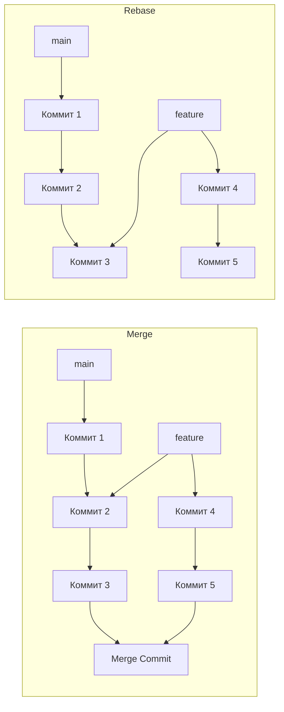
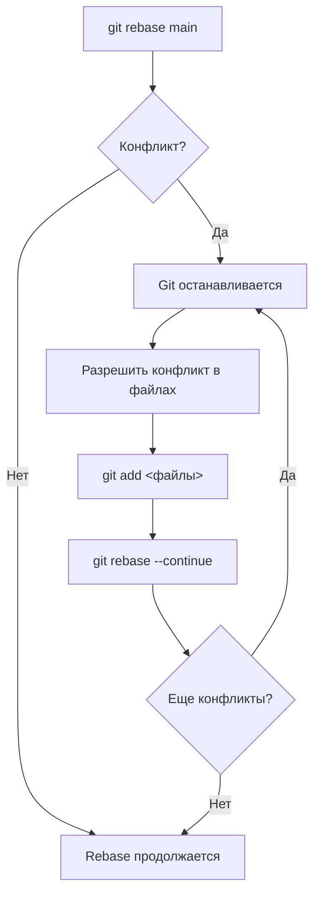
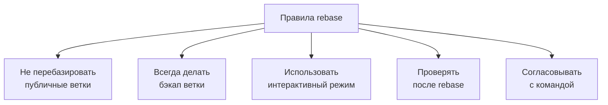

# 04. Перебазирование (rebase)

`git rebase` — это мощный инструмент для изменения истории коммитов. В отличие от `merge`, который создает новый коммит для объединения веток, `rebase` переносит (перебазирует) коммиты одной ветки поверх другой, создавая линейную историю.

## Что такое rebase?

Rebase берет коммиты из текущей ветки и применяет их поверх последнего коммита другой ветки. Это создает впечатление, что вы начали работать с ветки позже, чем на самом деле.

### Визуальное сравнение merge и rebase



## Базовое использование

```bash
# Переключиться на ветку, которую нужно перебазировать
git checkout feature

# Перебазировать на main
git rebase main

# Перебазировать с указанием ветки
git rebase main feature
```

## Основные опции rebase

| Опция | Описание | Пример |
| :--- | :--- | :--- |
| `-i` / `--interactive` | Интерактивный режим | `git rebase -i HEAD~3` |
| `--continue` | Продолжить после разрешения конфликтов | `git rebase --continue` |
| `--skip` | Пропустить текущий коммит | `git rebase --skip` |
| `--abort` | Отменить rebase | `git rebase --abort` |
| `--onto` | Перебазировать на другой коммит | `git rebase --onto new-base old-base feature` |

## Конфликты при rebase

Конфликты при rebase решаются аналогично merge, но процесс немного отличается:

### Шаги разрешения конфликта



```bash
# 1. Возникает конфликт
git rebase main

# 2. Разрешаем конфликт в файлах
# 3. Добавляем в индекс
git add file.txt

# 4. Продолжаем rebase
git rebase --continue

# 5. Для отмены:
git rebase --abort
```

## Интерактивный rebase

Интерактивный rebase позволяет изменять историю коммитов. Это один из самых мощных инструментов Git.

### Команды интерактивного rebase

| Команда | Описание |
| :--- | :--- |
| `pick` | Использовать коммит как есть |
| `reword` | Изменить сообщение коммита |
| `edit` | Остановиться для изменения коммита |
| `squash` | Объединить с предыдущим коммитом |
| `fixup` | Объединить с предыдущим коммитом (без сохранения сообщения) |
| `drop` | Удалить коммит |
| `exec` | Выполнить команду |

### Пример интерактивного rebase

```bash
# Запуск интерактивного rebase для последних 3 коммитов
git rebase -i HEAD~3

# В открывшемся редакторе:
pick abc123 feat: add feature A
pick def456 feat: add feature B
pick ghi789 feat: add feature C

# Меняем на:
pick abc123 feat: add feature A
squash def456 feat: add feature B
reword ghi789 feat: add feature C

# Сохраняем и выходим
```

### Сценарии использования интерактивного rebase

| Сценарий | Действие |
| :--- | :--- |
| **Объединение мелких коммитов** | Использовать `squash` или `fixup` |
| **Исправление сообщений** | Использовать `reword` |
| **Удаление ненужных коммитов** | Использовать `drop` |
| **Разделение коммита** | Использовать `edit` |

## Rebase vs Merge: когда что использовать

| Критерий | Merge | Rebase |
| :--- | :--- | :--- |
| **История** | Сохраняет ветвление | Создает линейную историю |
| **Простота** | Проще для понимания | Сложнее |
| **Безопасность** | Безопаснее (не переписывает историю) | Может быть опасным |
| **Командная работа** | Лучше для публичных веток | Использовать с осторожностью |
| **Чистота истории** | Может быть запутанной | Чистая и линейная |

### Рекомендации по использованию

| Ситуация | Рекомендация |
| :--- | :--- |
| **Публичные ветки (main, develop)** | Использовать `merge` |
| **Личные feature-ветки** | Можно использовать `rebase` |
| **Перед созданием pull request** | Использовать `rebase` для обновления |
| **Большое количество разработчиков** | Использовать `merge` для безопасности |

## Правила безопасного rebase



### Безопасная практика

```bash
# 1. Создать бэкап ветки перед rebase
git checkout feature
git branch feature-backup

# 2. Выполнить rebase
git rebase main

# 3. Проверить результат
git log --oneline --graph

# 4. Если что-то пошло не так - восстановиться
git checkout feature-backup
git branch -D feature
git branch -m feature-backup feature
```

## Расширенные возможности

### Перебазирование на конкретный коммит

```bash
# Перебазировать на определенный коммит
git rebase --onto main~2 main feature

# Это перенесет feature на коммит, который был 2 коммита назад от main
```

### Rebase с сохранением merge commit

```bash
# Сохранить merge commits при rebase
git rebase --rebase-merges main
```

## Итоговая таблица команд

| Команда | Описание |
| :--- | :--- |
| `git rebase main` | Перебазировать текущую ветку на main |
| `git rebase -i HEAD~3` | Интерактивный rebase для 3 коммитов |
| `git rebase --continue` | Продолжить после разрешения конфликтов |
| `git rebase --abort` | Отменить rebase |
| `git rebase --skip` | Пропустить текущий коммит |
| `git rebase --onto` | Перебазировать на другой коммит |

> [!tip]
> Используйте `rebase` для локальных веток, чтобы поддерживать чистую историю перед созданием pull request. Используйте `merge` для сохранения истории ветвления в публичных ветках.

> [!warning]
> Никогда не перебазируйте ветки, которые уже были опубликованы и на которые кто-то ссылается. Это может привести к проблемам у других разработчиков. Если вы уже сделали `push` ветки, не делайте `rebase` без согласования с командой.
