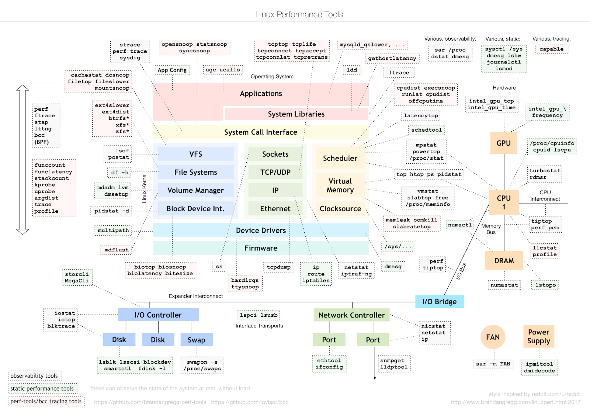
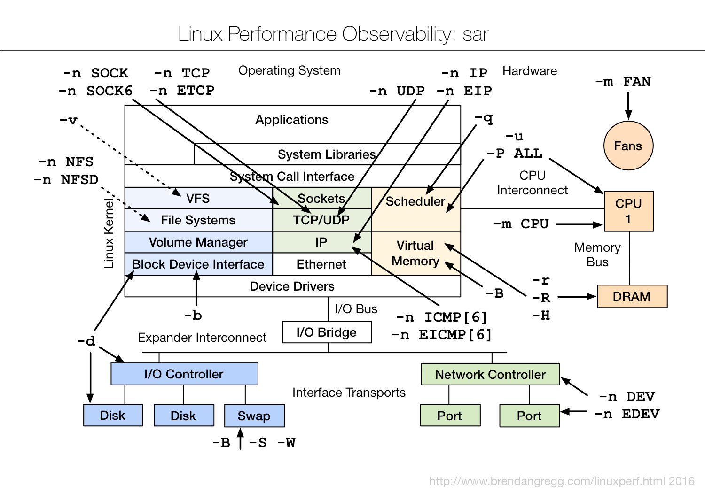
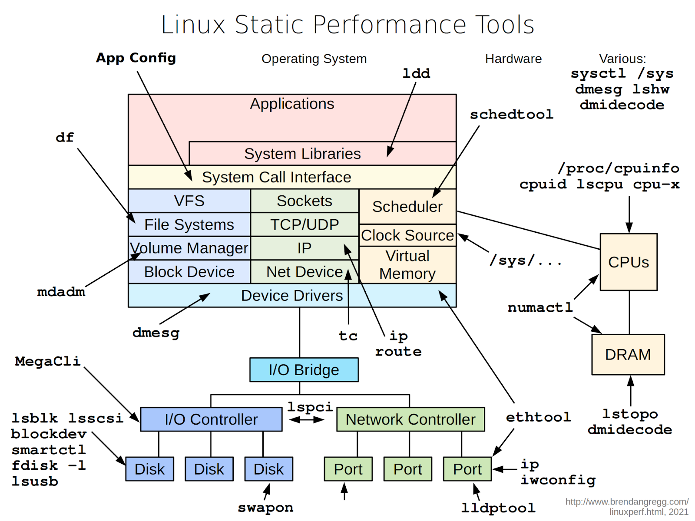
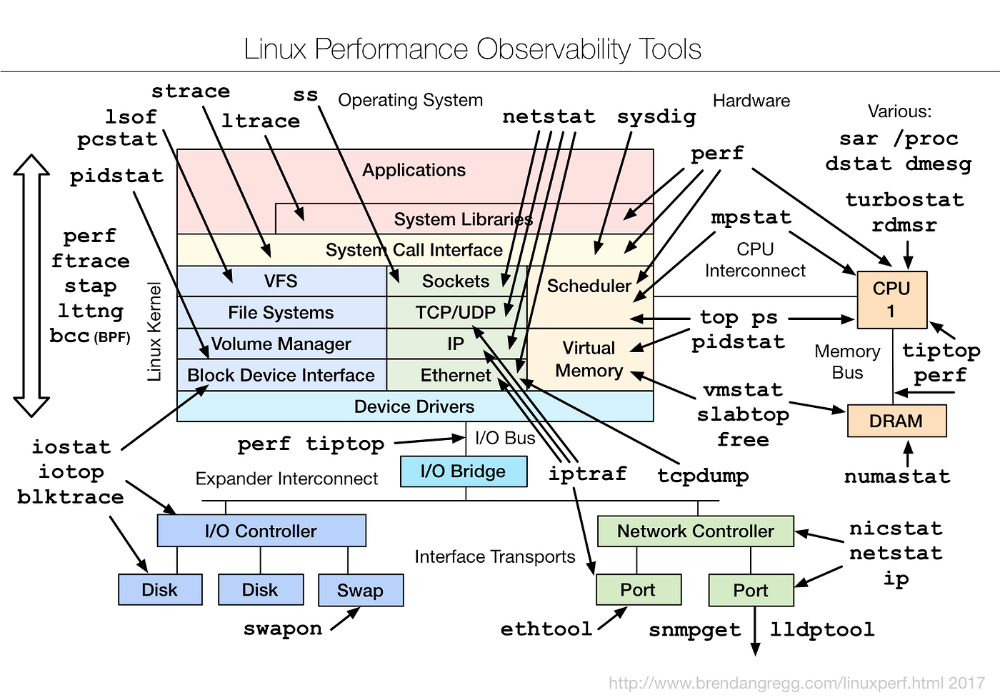

# Заключение по первой части

**Linux сам по себе весьма прозрачен** – через `/proc` и `/sys` можно получить практически все интересующие показатели системы. Мониторинговые инструменты для Linux в основном занимаются опросом этих интерфейсов и передачей данных централизованно.

Для успешного мониторинга Linux-сервера необходимо:

- Знать, какие **нормы** для метрик (что такое «обычно» и «аномально» для CPU, LA, памяти и т.п. на вашем типе нагрузки).
- Правильно **настроить сбор**, если используется внешняя система мониторинга – все ключевые аспекты должны быть покрыты.
- **Анализировать метрики комплексно**: например, рост LA + рост IOwait + 0% idle + постоянный своп = чёткая картина перегруженного сервера, требующего внимания.
- Не забывать заглядывать в **логи** – они дополняют картину.

Далее рассматривается построение мониторинга за пределами одного сервера.

## Дополнение

Ниже приведены несколько схем от Брендона Грега, которые помогают исследовать различные проблемы в Linux, в том числе с производительностью.

